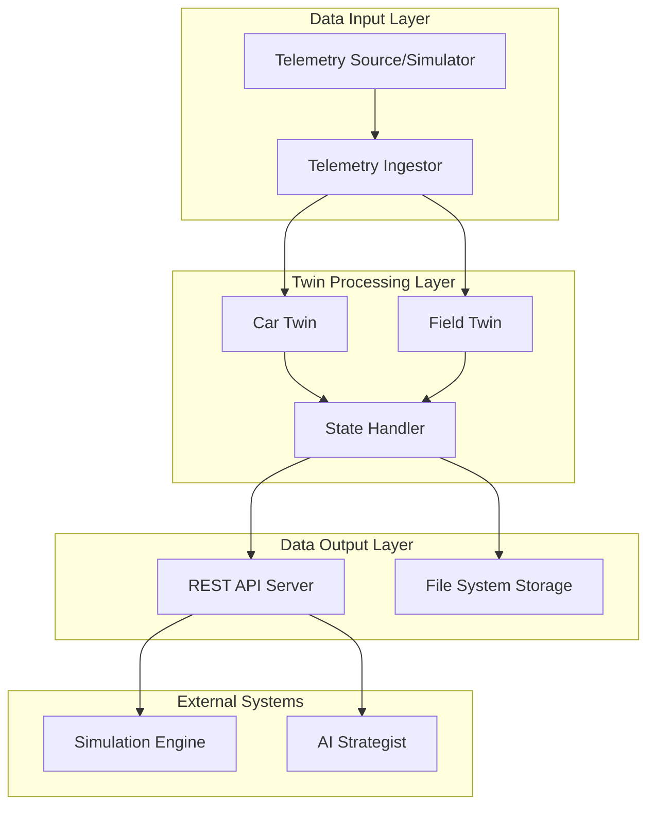

# Design Document

## Overview

The F1 Dual Digital Twin System implements a modular, event-driven architecture that maintains real-time digital representations of racing conditions through two primary twin models: the Car Twin and Field Twin. The system processes continuous telemetry streams, maintains synchronized state across components, and provides low-latency data access for external simulation and AI strategy systems.

The architecture follows a pipeline pattern with clear separation of concerns: telemetry ingestion → twin model updates → state persistence → external API exposure. This design ensures scalability, maintainability, and real-time performance under race conditions.

## Architecture

### High-Level Architecture



### Component Interaction Flow

1. **Telemetry Ingestor** receives raw telemetry data and normalizes it
2. **Car Twin** and **Field Twin** process relevant telemetry updates in parallel
3. **State Handler** coordinates state updates and ensures consistency
4. **REST API** provides real-time access to current twin states
5. **File System Storage** maintains persistent state for recovery

## Components and Interfaces

### Telemetry Ingestor (`telemetry_feed.py`)

**Purpose:** Continuous telemetry data collection, validation, and normalization

**Key Methods:**
- `ingest_telemetry()` - Main processing loop for incoming data
- `normalize_data(raw_data)` - Convert raw telemetry to standard JSON format
- `validate_schema(data)` - Ensure data completeness and format compliance
- `handle_missing_data(data)` - Fallback logic for corrupted/missing data

**Data Flow:**
- Input: Raw telemetry streams (simulated or live)
- Processing: Validation → Normalization → Schema compliance
- Output: Standardized JSON to `/shared/telemetry_state.json`

**Performance Requirements:**
- Processing latency: < 250ms per telemetry update
- Update frequency: Every 3 seconds
- Error handling: Graceful degradation with last-known-good state

### Car Twin (`twin_model.py`)

**Purpose:** High-fidelity digital model of our racing car's current state

**Key Methods:**
- `update_car_state(telemetry_data)` - Process new telemetry and update internal state
- `predict_tire_degradation()` - Calculate tire wear progression based on current conditions
- `estimate_fuel_consumption()` - Project fuel usage and remaining laps
- `calculate_pit_window()` - Determine optimal pit stop timing
- `get_performance_delta()` - Compare current vs. optimal lap times

**State Management:**
- Core metrics: speed, tire temp/wear, fuel level, lap times
- Derived metrics: degradation trends, fuel consumption rate, pit predictions
- Update frequency: Real-time (< 200ms latency)

**Algorithms:**
- Tire degradation: Linear regression with temperature and track surface factors
- Fuel consumption: Moving average with track-specific consumption models
- Performance prediction: Delta analysis against reference lap times

### Field Twin (`hpc_orchestrator.py`)

**Purpose:** Behavioral modeling and prediction of competitor strategies

**Key Methods:**
- `update_competitor_models(competitor_data)` - Process competitor telemetry
- `analyze_pit_patterns()` - Identify strategic tendencies per competitor
- `predict_competitor_laptimes()` - Forecast performance based on tire/fuel state
- `detect_strategic_opportunities()` - Identify gaps and strategic windows
- `trigger_resimulation(event_type)` - Handle race events (pit stops, safety cars)

**Behavioral Models:**
- Pit strategy patterns: Historical analysis of undercut/overcut preferences
- Performance degradation: Competitor-specific tire and fuel models
- Strategic response: Reaction patterns to our strategic moves

**Event Handling:**
- Pit stop detection and strategy classification
- Safety car deployment and restart predictions
- Track position changes and gap analysis

### State Handler (`dashboard.py`)

**Purpose:** Centralized state management, persistence, and consistency

**Key Methods:**
- `persist_state()` - Atomic write operations to local storage
- `load_recovery_state()` - System recovery from interruptions
- `ensure_consistency()` - Cross-twin data validation
- `handle_concurrent_access()` - Thread-safe state updates
- `audit_log(change_event)` - Change tracking for debugging

**Storage Strategy:**
- Primary: JSON files for human readability and debugging
- Backup: SQLite for transactional integrity and complex queries
- Frequency: Every 5 seconds or on significant state changes

**Concurrency Control:**
- Read-write locks for twin state access
- Atomic file operations for persistence
- Event queuing for high-frequency updates

### REST API Server

**Purpose:** Low-latency data access for external systems

**Endpoints:**
- `GET /api/car-twin` - Current car state and predictions
- `GET /api/field-twin` - Competitor models and strategic analysis
- `GET /api/telemetry` - Raw and processed telemetry data
- `GET /api/environment` - Track conditions and race state
- `GET /api/health` - System status and performance metrics

**Performance Specifications:**
- Response time: < 50ms for all endpoints
- Concurrent connections: Support 10+ simultaneous clients
- Data format: JSON with schema versioning
- Caching: In-memory cache for frequently accessed data

## Data Models

### Telemetry State Schema

```json
{
  "timestamp": "2024-03-17T14:30:45.123Z",
  "lap": 26,
  "session_type": "race",
  "track_conditions": {
    "temperature": 40.1,
    "weather": "sunny",
    "track_status": "green"
  },
  "cars": [
    {
      "car_id": "44",
      "team": "Mercedes",
      "driver": "Hamilton",
      "position": 3,
      "speed": 301.2,
      "tire": {
        "compound": "medium",
        "age": 12,
        "wear_level": 0.42
      },
      "fuel_level": 0.55,
      "lap_time": 83.245,
      "sector_times": [28.1, 31.2, 23.9]
    }
  ]
}
```

### Car Twin State Schema

```json
{
  "car_id": "44",
  "timestamp": "2024-03-17T14:30:45.123Z",
  "current_state": {
    "speed": 301.2,
    "tire_temp": [85.2, 87.1, 84.8, 86.5],
    "tire_wear": 0.42,
    "fuel_level": 0.55,
    "lap_time": 83.245
  },
  "predictions": {
    "tire_degradation_rate": 0.008,
    "fuel_consumption_rate": 2.1,
    "predicted_pit_lap": 35,
    "performance_delta": -0.3
  },
  "strategy_metrics": {
    "optimal_pit_window": [33, 37],
    "tire_life_remaining": 8,
    "fuel_laps_remaining": 26
  }
}
```

### Field Twin State Schema

```json
{
  "timestamp": "2024-03-17T14:30:45.123Z",
  "competitors": [
    {
      "car_id": "33",
      "team": "Red Bull",
      "current_position": 1,
      "gap_to_leader": 0.0,
      "predicted_strategy": "two_stop",
      "pit_probability": 0.15,
      "strategic_threat_level": "high",
      "behavioral_profile": {
        "undercut_tendency": 0.7,
        "aggressive_defense": 0.8,
        "tire_management": 0.6
      }
    }
  ],
  "strategic_opportunities": [
    {
      "type": "undercut_window",
      "target_car": "33",
      "probability": 0.65,
      "execution_lap": 28
    }
  ]
}
```

## Error Handling

### Telemetry Data Issues
- **Missing data packets:** Use interpolation from recent valid data points
- **Corrupted data:** Validate against schema and reject invalid entries
- **Network interruptions:** Buffer data locally and sync when connection restored
- **Schema changes:** Version-aware parsing with backward compatibility

### Twin Model Failures
- **Calculation errors:** Fallback to simplified models with reduced accuracy
- **State inconsistency:** Reset to last known consistent state
- **Memory issues:** Implement data pruning for historical state
- **Performance degradation:** Dynamic adjustment of update frequencies

### System-Level Failures
- **Storage failures:** Automatic failover to backup storage mechanisms
- **API unavailability:** Queue requests and process when service restored
- **Concurrent access conflicts:** Retry logic with exponential backoff
- **Recovery scenarios:** Automated state reconstruction from audit logs

## Testing Strategy

### Unit Testing
- **Component isolation:** Mock external dependencies for pure unit tests
- **Data validation:** Test schema compliance and edge cases
- **Algorithm accuracy:** Validate prediction models against known scenarios
- **Performance benchmarks:** Ensure latency requirements are met

### Integration Testing
- **End-to-end data flow:** Telemetry ingestion through API output
- **State consistency:** Verify twin synchronization under load
- **Concurrent access:** Multi-client API access patterns
- **Recovery testing:** System restart and state reconstruction

### Performance Testing
- **Latency validation:** Measure response times under various loads
- **Throughput testing:** Maximum telemetry processing rates
- **Memory profiling:** Long-running stability and memory usage
- **Stress testing:** System behavior under race-day conditions

### Simulation Testing
- **Historical race replay:** Validate twin accuracy against known race data
- **Strategy validation:** Compare predictions with actual race outcomes
- **Edge case scenarios:** Safety cars, weather changes, mechanical failures
- **Competitor behavior:** Validate Field Twin predictions against real strategic decisions